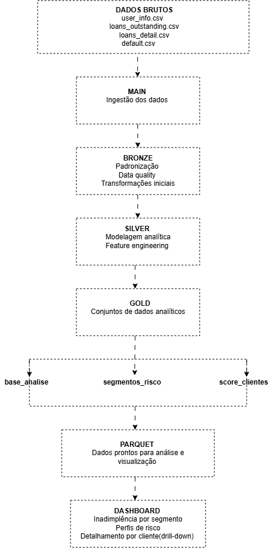
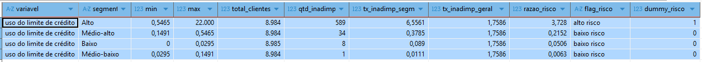
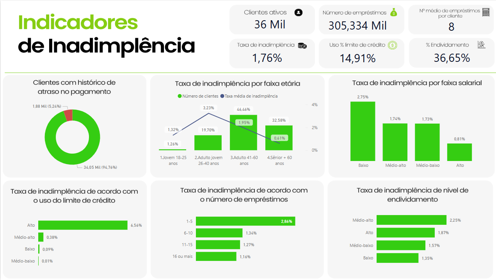
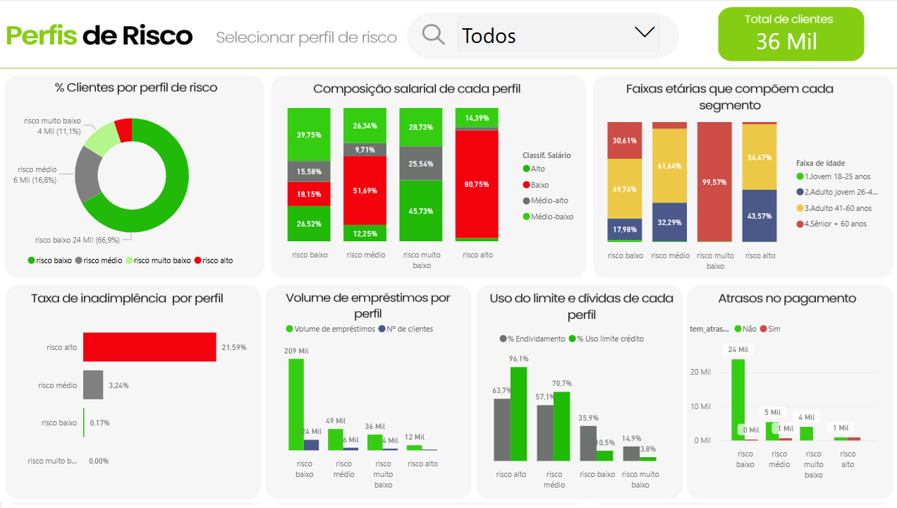
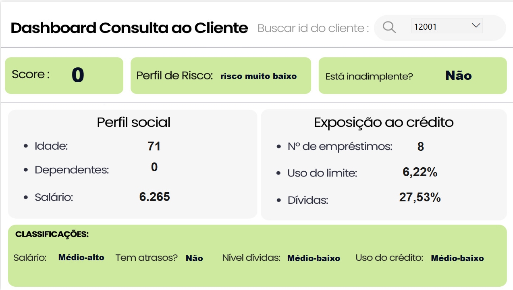

## Análise de Risco de Crédito — Pipeline End-to-End

Projeto de análise de risco de crédito, realizado de ponta a ponta, usando DuckDB e SQL para transformar dados brutos de clientes e empréstimos em segmentos de risco, indicadores de risco relativos e uma pontuação de risco no nível do cliente.

`Stack: DuckDB · SQL · DBeaver · Python ( Google Colab) · Power BI · DAX`

---

## 1. Visão Geral

Este projeto desenvolve um pipeline analítico completo para avaliação de risco de crédito. Dados brutos de clientes, empréstimos e inadimplência são ingeridos e transformados usando DuckDB por meio de uma arquitetura em camadas baseada nas camadas Main, Bronze, Silver e Gold. Os conjuntos finais de dados analíticos são usados para calcular taxas de inadimplência, razões de risco relativas e um score de risco a nível de cliente.

---

## 2. Problema de negócio

> As instituições financeiras precisam identificar os perfis de clientes associados a um risco de crédito mais alto para apoiar a avaliação de crédito, o monitoramento e a gestão da carteira.
> 

### Pergunta-chave

> Quais características de clientes e de crédito estão associadas a um maior risco de inadimplência, e como essas características podem ser combinadas em uma pontuação de risco do cliente que seja fácil de entender?
> 

---

## 3. Objetivos

- Identificar os perfis de clientes associados a taxas mais altas de inadimplência;
- Calcular o risco relativo entre os diferentes segmentos de clientes;
- Desenvolver uma pontuação de risco (score de crédito) que permita avaliar e classificar o risco de crédito individual de cada cliente com base em suas características financeiras e comportamentais.
- Criar um pipeline de dados reproduzível usando DuckDB e SQL.

## Hipóteses levantadas

1. Pessoas mais jovens correm maior risco de não pagamento
2. Pessoas com mais empréstimos ativos têm maior risco de inadimplência
3. Pessoas que atrasaram pagamentos por mais de 90 dias têm maior risco de inadimplência

---

## 4. Fonte de dados

Os dados levantados foram obtidos a partir dos seguintes arquivos:

| Nome do arquivo | Descrição | Total de registros iniciais |
| --- | --- | --- |
| `user_info.csv/cadastro_clientes` | Dados cadastrais dos clientes (idade, gênero, salário, dependentes) | 36.000 |
| `loans_outstanding.csv/carteira_emprestimos` | Dados referentes aos empréstimos ativos por cliente, se do tipo imóveis ou outros | 305.335 |
| `loans_detail.csv/detalhes_emprestimos` | Contém dados relacionados ao comportamento de pagamento dos clientes , como número de atrasos, uso percentual do limite de crédito e nível de endividamento , ou seja, percentual que as dívidas representam em relação ao patrimônio do cliente. | 36.000 |
| `default.csv/flag_inadimplencia` | Flag de inadimplência, onde 0 indica que é o cliente está adimplente e 1 indica que está inadimplente. | 36.000 |

---

## 5. Ferramentas, linguagens e tecnologias

| Ferramenta/Tecnologia | Uso |
| --- | --- |
| **DuckDB + Dbeaver** | Armazenamento, consultas SQL e limpeza de dados |
| **Google Colab + Python** | Análise exploratória e visualizações  |
| **Power BI** | Dashboard interativo para consulta de risco por cliente |
| **Canva** | Design dashboard e apresentação dos resultados |

**Linguagens:** SQL · Python

**Bibliotecas Python:** `pandas` · `matplotlib` · `seaborn`

---

## 6. Pipeline de dados

O projeto foi concebido como um pipeline analítico de ponta a ponta, usando DuckDB e SQL para ingerir, transformar e organizar dados brutos de clientes e crédito em conjuntos de dados prontos para análise de risco de crédito e visualização. 

O pipeline segue uma arquitetura em camadas composta pelas camadas Main, Bronze, Silver e Gold, sendo que cada camada tem uma responsabilidade específica no processo de transformação de dados.

Os conjuntos de dados finais construídos na camada Gold são exportados no formato Parquet e servem como fonte de dados para a camada analítica e o dashboard de risco de três páginas.

### 6.1 Visão geral

0

### 6.2 Arquitetura em camadas

- Main : Arquivos CSV brutos são importados para o DuckDB sem transformação, preservando a fonte original.
- Bronze: Os dados são padronizados e regras iniciais de qualidade são aplicadas, incluindo renomeação de colunas, normalização de categorias e criação de sinais de qualidade dos dados.
- Silver: Dimensões de clientes e características de risco de crédito são criadas, incluindo faixas etárias, classificações de renda, classificações de inadimplência, utilização de crédito e classificações de dívida.
- Gold: Conjuntos de dados analíticos são criados para segmentação de risco, análise de risco relativo e pontuação no nível do cliente.

> Para uma descrição detalhada das transformações, data quality, feature engineering  e implementação em SQL camada por camada, veja a Documentação de Transformação de Dados.
> 

---

## 7. Construção do modelo de score de risco

Para a construção do modelo de score de risco, adotou-se a metodologia de cálculo de **risco relativo (*relative risk*)**, abordagem clássica em epidemiologia, aqui adaptada ao contexto de concessão de crédito. Essa metodologia permite comparar segmentos de diferentes escalas em uma única métrica, normalizada pela taxa de inadimplência da população total (baseline). O processo foi estruturado nas seguintes etapas:

### 7.1 Segmentação dos clientes

Os clientes foram agrupados com base em **cinco variáveis** consideradas relevantes para o perfil de crédito:

- idade,
- salário
- número de atrasos
- uso do limite de crédito
- taxa de endividamento

Cada variável foi discretizada em faixas (segmentos) para viabilizar a análise comparativa.

#### 7.2 Cálculo do índice de inadimplência de cada segmento

Para cada segmento derivado das variáveis acima, calculou-se o **índice de inadimplência**, dado por:

> **Índice de inadimplência do segmento** = (número de clientes inadimplentes no segmento) / (total de clientes no segmento)
> 

Esse indicador representa a proporção de maus pagadores dentro de cada grupo específico.

#### 7.3 **Cálculo do risco relativo (*Relative Risk* – RR)**

O risco relativo de cada segmento foi obtido pela razão entre seu índice de inadimplência e o índice médio da amostra total (aproximadamente **36 mil clientes**):

> **Risco Relativo (RR)** = (Índice de inadimplência do segmento) / (Índice de inadimplência da amostra total)
> 

#### **Critério de interpretação:**

| **Valor do RR** | **Interpretação** |
| --- | --- |
| **RR = 1** | O segmento apresenta taxa de inadimplência igual à média da carteira. |
| **RR > 1** | O segmento é mais arriscado que a média. Exemplo: RR = 1,8 indica **80% mais propensão** à inadimplência. |
| **RR < 1** | O segmento é mais seguro que a média, com menor propensão ao default. |

#### 7.4 Atribuição da flag e dummy de risco para cada segmento de acordo com o resultado da razão de risco

Com base no valor do risco relativo, cada segmento recebeu uma classificação binária de risco:

- **RR ≥ 1** → *flag* **ALTO RISCO** e *dummy* = 1
- **RR < 1** → *flag* **BAIXO RISCO** e *dummy* = 0

Essa dummy indica, para cada cliente, se ele pertence a um segmento de alto risco em relação à variável analisada.

A tabela abaixo ilustra o resultado final dessa etapa em relação à variável uso do limite de crédito :



#### 7.5 Modelo de Score por Dummies

O modelo de score é construído a partir da **soma das variáveis binárias (dummies)**, cada uma associada a uma das cinco dimensões de risco consideradas:

- `dummy_idade`
- `dummy_salario`
- `dummy_atrasos`
- `dummy_uso_credito`
- `dummy_dividas`

O score total é calculado como:

> **score_total** = dummy_idade + dummy_salario + dummy_atrasos + dummy_uso_credito + dummy_dividas
> 

Esse escore varia de **0 a 5**, onde:

- **0** indica ausência de fatores de risco;
- **5** indica que todos os fatores de risco estão presentes.

A imagem a seguir exemplifica a classificação de um cliente com base nesse sistema.

#### 7.6 Classificação dos clientes em perfis de risco

Com base na pontuação obtida, os clientes foram enquadrados em **quatro perfis de risco**, conforme a tabela abaixo:

| **Score Total** | **Perfil de Risco Final** | **Interpretacao** |
| --- | --- | --- |
| **0** | risco muito baixo | Nenhum fator de risco presente - perfil altamente seguro |
| **1 a 2** | risco baixo | Poucos fatores de risco - cliente com boa saude financeira |
| **3** | risco medio | Multiplos fatores de risco - requer analise adicional |
| **4 a 5** | risco alto | Maioria dos fatores de risco presentes - alto potencial de inadimplencia |

Essa classificação final fornece uma visão sintética e acionável do nível de exposição ao risco de cada cliente, subsidiando decisões de concessão, precificação e monitoramento de carteira.

---

## 9. Resultados e conclusões

#### 9.1 Identificação dos segmentos de clientes com maior incidência de inadimplência

- Adultos jovens, com idade entre 26 e 40 anos e Adultos, com idade entre 41 e 60 anos, têm as maiores taxas de inadimplência: 3,23% e 1,95% respectivamente.
- Clientes cujo uso do limite de crédito é considerado alto (metade usam até 90,83% do limite de crédito) - suas taxas de inadimplência chegam a 6,56%.
- Clientes com histórico de atraso no pagamento, com taxa de inadimplência de 30,59% (191 vezes maior do que os clientes sem histórico de atraso).
- Com faixas salariais baixas, com taxa de inadimplência de 2,75% (taxa até 3,39 vezes maior do que os clientes com salários mais altos).
- Endividamento médio-alto (endividamento mediano de 50,45%) e alto (endividamento mediano de 77.325 %) , com taxas de inadimplência de 2,25% e 1,87% respectivamente.
- Clientes com dependentes? Perguntar ao chat como expor isso!

#### 9.2 Perfis de risco

#### RISCO ALTO - Representam 5,1% da base

- Salário mediano 2.900
- Idade mediana 42 anos
- Taxa de inadimplência de 21,59%
- Concentram 3,83% do volume total de empréstimos
- Endividamento mediano de 63,67%
- Uso mediano do limite de crédito de 96,08%
- 50,22% tem histórico de atrasos

#### RISCO BAIXO - Representam 66,94% da base

- Salário mediano de 5.400
- Idade mediana 52 anos
- Taxa de inadimplência de 0,17%
- Concentram 68,40 % do volume total de empréstimos
- Endividamento mediano de 35,9%
- Uso mediano do limite de crédito de 10,5%
- 98,80% não tem histórico de atrasos

#### RISCO MUITO BAIXO - Representam 11,1% da base

- Salário mediano de 7.000
- Idade mediana 67 anos
- Taxa de inadimplência de 0,0%
- Concentram 11,81 % do volume total de empréstimos
- Endividamento mediano de 14,91%
- Uso mediano do limite de crédito de 3,8%
- 100% não tem histórico de atrasos

#### RISCO MÉDIO - Representam 16,8% da base

- Salário mediano de 3800
- Idade mediana 45 anos
- Taxa de inadimplência de 3,24%
- Concentram 15,95 % do volume total de empréstimos
- Endividamento mediano de 57,19%
- Uso mediano do limite de crédito de 70,71%
- 11,11% tem histórico de atrasos

---

## 10. Insights

Principais descobertas sobre os **36.000 clientes** da base:

- **Gênero:** 60% homens · 40% mulheres
- **Salário:** média de R$ 6.425 · mediana de R$ 5.408 · alto desvio padrão (R$ 11.614)
- **Idade:** metade dos clientes entre 41 e 63 anos · média de ~52 anos
- **Dependentes:** 60,67% sem dependentes
- **Empréstimos:** média de 8–9 por cliente · apenas 12% são imobiliários
- **Inadimplência geral:** **1,76%**
- **Atrasos > 90 dias:** 95% nunca atrasaram
- **Uso do limite de crédito:** 50% usam até 15% do limite disponível
- **Endividamento:** 25% dos clientes têm mais de 87% do patrimônio comprometido

---

## 11. Dashboard & BI

#### 11.1 Indicadores de inadimplência

> Fornece uma visão geral dos indicadores de inadimplência entre os segmentos de clientes, permitindo comparar as taxas de inadimplência.
> 



#### 11.2 Perfis de risco

> Fornece uma visão geral da distribuição do perfil de risco dos clientes com base na estrutura de pontuação de risco, permitindo que os usuários identifiquem a concentração de clientes nas categorias de risco muito baixo, baixo, médio e alto.
> 



#### 11.3 Detalhamento do cliente

> Permite aos usuários analisar individualmente cada cliente e verificar seu perfil de risco e os indicadores de risco usados na estrutura de pontuação.
> 



---

## 12. Estrutura do Repositório

```sql
project/
│
├── data/
│   ├── raw/
│   └── processed/
│
├── duckdb/
│   ├── 01_main.sql
│   ├── 02_bronze.sql
│   ├── 03_silver.sql
│   └── 04_gold.sql
        05_exportar_parquet.sql
│
├── notebooks/
│   ├── 01_eda.ipynb
│   ├── 02_risk_analysis.ipynb
│   └── 03_visualization.ipynb
│
├── docs/
│
└── README.md
```

---

## 13. Como Reproduzir

```sql
# 1. Clone o repositório

git clone https://github.com/<seu-usuario>/super-caja-bank.git

# 2. Rode os scripts SQL na ordem: main -> bronze -> silver -> gold

# (via DBeaver conectado a um arquivo DuckDB local, ou duckdb CLI)

# 3. Exporte as tabelas Gold para Parquet

# (ver notebooks/exploracao_gold_para_parquet.ipynb)

# 4. Abra powerbi/super_caja_bank.pbix e aponte para data/gold/*.parquet
```

---

## 14. Limitações e próximos passos

O modelo pode ser aprimorado com a inclusão de variáveis adicionais:

- **Fontes de renda adicionais** — visão mais precisa da capacidade de pagamento
- **Tempo de serviço** — indicador de estabilidade no emprego
- **Patrimônio do cliente** — possibilidade de uso como garantia
- **Tempo de residência** — proxy de estabilidade pessoal
- **Tempo de cadastro no banco** — indicador de confiabilidade histórica
- **Nível educacional** — correlacionado com potencial de renda

---

## 15. Documentos adicionais

Dicionário dos dados originais

Pipeline transformação dos dados

Check list tratamento inicial dos dados

Consultas SQL

Documentação detalhada arquitetura e pipeline

## Sobre

Projeto desenvolvido por Suzan, em transição de carreira para Analytics Engineering, com background em gestão administrativo-financeira em varejo/e-commerce.

📫 LinkedIn
